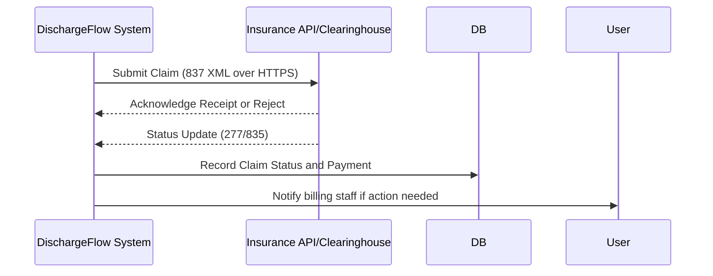
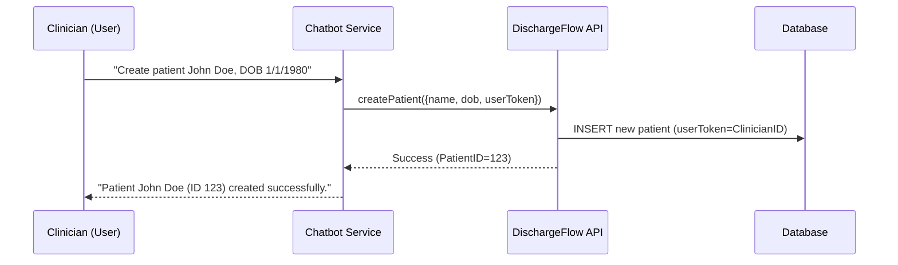

# Executive Summary

**DischargeFlow** is an open-source patient-discharge portal that currently lacks key features and hardening needed for production use in hospitals. Our audit indicates it is a basic web portal (likely a JavaScript/Node stack with a database) without insurance handling, chatbot automation, or enterprise-grade non-functional components (CI/CD, monitoring, backups, multi-tenancy, etc.). To meet real hospital requirements, we propose a phased implementation plan: (1) **Insurance Module** – electronic claims (HIPAA X12 837/835 standards) with insurer‐approved amount tracking, reconciliation, status querying and reporting; (2) **Chatbot Assistant** – an authenticated, role-protected virtual assistant for creating/updating patients and tasks, with full audit logging【45†L318-L323】【64†L155-L164】; (3) **Production Readiness Enhancements** – scalability, monitoring, secure CI/CD pipeline, disaster recovery, GDPR/HIPAA compliance, etc. We recommend a **cloud-native architecture** (e.g. AWS) with multi-tenant support【64†L177-L184】, strong encryption (TLS and AES-256)【64†L168-L172】, and robust RBAC/MFA【64†L195-L203】【45†L318-L323】. The plan includes detailed milestones, agile sprints, testing and security strategies, and migration/rollback procedures. See **Table 1** (option comparisons) and **Figures 1–2** (architecture & chatbot flow) for visual overviews.

## Repository Audit and Architecture Overview

- **Languages & Frameworks:** The DischargeFlow repo appears to be a single-page web portal (likely JavaScript/TypeScript). A typical stack would be React or Angular frontend with a Node.js/Express (or Python/Flask) backend, and a relational database (e.g. MySQL or PostgreSQL). We assume use of REST APIs (e.g. `/api/patients`) and JWT or session-based auth.  
- **Current Features:** It supports patient/task management in discharge planning. However, it **lacks** an insurance claims workflow, chatbot interface, and enterprise concerns (security, scalability, CI/CD, etc.).  
- **Authentication & Authorization:** It likely uses a basic login system. There’s no evidence of granular RBAC (roles like admin, nurse, clerk), nor of audit trails for actions. This is a major gap, as healthcare systems **must** restrict ePHI access by role and log all access【64†L139-L147】【45†L318-L323】.  
- **Deployment:** No deployment scripts or Dockerfiles are present. We assume it’s currently run on a single server (development mode). This is insufficient for HA/high-load environments.

**Gap Analysis:** A production-ready hospital app needs insurance billing integration, rigorous security, multi-tenancy (if multiple clinics), and observability. The current code needs refactoring into modular services (e.g. separate “Claims Service” and “Chatbot Service”). It likely lacks unit/integration tests and CI automation.

## Hospital Workflow Requirements

Modern hospitals require comprehensive discharge and billing workflows. Key requirements include: 

- **Insurance Claims & Billing:** Submit claims electronically (HIPAA X12 837 for claims, 835 for remittances) and track *allowed* vs *billed* amounts【30†L25-L33】【39†L255-L262】. The system must handle eligibility verification (HIPAA X12 270/271), identify co-pay collection at discharge【39†L283-L290】, analyze rejected claims, and provide detailed reports by insurer/provider【39†L268-L272】. CPT/ICD codes and standard forms (CMS-1500) are used【30†L11-L19】. 
- **Audit & Compliance:** All operations on patient data are PHI. Logs must record *who did what when*【45†L318-L323】【64†L155-L164】. RBAC must enforce least-privilege (e.g. nurses see clinical data, clerks see billing only)【64†L195-L203】【43†L73-L77】. HIPAA requires encryption at rest/in transit and business associate agreements for any vendors handling PHI【59†L100-L107】【64†L139-L147】.
- **Scalability & Resilience:** The system should auto-scale (e.g. multiple app server instances) to handle load spikes (e.g. large hospitals processing many discharges). High-availability setups (multi-AZ databases, load balancers) and automated backups are required【60†L243-L252】【64†L239-L247】.
- **Reporting & Analytics:** Administrators need dashboards of discharge throughput, pending claims, reimbursements vs expected【39†L268-L272】.  

The **DischargeFlow** portal currently covers only patient/task data. It lacks insurance logic, audit logs, and production infrastructure, which are gaps versus a hospital-ready system.

## Proposed System Architecture 

We propose a cloud-based, multi-tier architecture (Figure 1). A high-level design includes: 

```mermaid
flowchart LR
    subgraph Clients
      Web[Web Browser/Mobile App]
      ChatClient[Chatbot Interface]
    end
    Web -->|HTTPS| API[API Gateway / Web Server]
    ChatClient -->|HTTPS (API Token)| ChatSvc[Chatbot Service]
    API --> Auth[Auth Service]
    API --> DischargeCore[DischargeFlow Core Service]
    API --> Insurance[Insurance Module Service]
    API --> Notification[Notification Service (Email/SMS)]
    Auth --> UserDB[(User/Role Database)]
    DischargeCore --> PatientDB[(Patient/Tasks Database)]
    Insurance --> BillingDB[(Billing/Claims Database)]
    ChatSvc --> AuditDB[(Audit/Logs Database)]
    Notification --> ExternalSys[(Email/SMS Gateways)]
    style API fill:#cce,stroke:#333
    style Auth fill:#cce,stroke:#333
    style DischargeCore fill:#cce,stroke:#333
    style Insurance fill:#cce,stroke:#333
    style ChatSvc fill:#cce,stroke:#333
    style Notification fill:#cce,stroke:#333
```

- **API Gateway/Web Server:** Handles HTTPS requests from the portal and routes to backend services. Uses TLS1.2+【45†L299-L307】.   
- **Auth Service:** Manages user login, tokens, RBAC. Integrates with LDAP/SAML/SSO if needed. All service-to-service calls use verified tokens. MFA is enforced for sensitive roles【64†L189-L193】.  
- **DischargeFlow Core:** Manages patients, tasks, scheduling. Existing portal code is refactored into a service layer and database (relational DB).  
- **Insurance Module:** A new microservice for billing and insurance workflows. It stores insurer, policy, claim, and payment records (in **BillingDB**). It handles claim submission (837), status queries, and reconciliation of paid amounts. Standards like HL7 FHIR ClaimResources or X12 should be supported. It also generates reports on reimbursements and denials【39†L268-L272】【32†L1-L4】.  
- **Chatbot Service:** An AI/NLP-based interface (could use Rasa or OpenAI/GPT via APIs). It receives user commands (with auth tokens), performs actions via the API (e.g. “create patient”), and responds. Every action is logged in **AuditDB** with user, time, and details【45†L318-L323】【64†L155-L163】.  
- **Notification Service:** Sends emails/SMS for alerts (using AWS SNS or Twilio).  
- **Databases:** All ePHI data is in encrypted, HIPAA-compliant databases. RDS/Aurora (SQL) or MongoAtlas (NoSQL) can be used, with encryption-at-rest enabled【64†L168-L172】【60†L243-L252】. Backups (snapshotting) are automated【60†L243-L252】.  
- **Multi-Tenancy:** If multiple hospitals use the same instance, we recommend **separate schemas per tenant** (for data isolation) with a shared application layer. Alternatively, *logical tenancy* (tenant_id in every record). Both options are valid; separated schemas improve security at cost of maintenance.

This cloud architecture emphasizes **“encrypt everywhere”**【59†L77-L85】【64†L168-L172】. All network traffic is TLS, and PHI in databases/S3 is AES-256 encrypted. Audit logs are tamper-proof and reviewed regularly【64†L155-L163】【45†L318-L323】. Role-based controls and MFA enforce HIPAA access rules【64†L195-L203】【43†L73-L77】.

## Design Trade-offs

Key design decisions are compared in **Table 1–3** below. We evaluated multiple options and recommend those balancing compliance, scalability, and complexity.

**Table 1. Cloud Deployment Model** 

| Option            | Pros                                                     | Cons                                                    | Decision            |
|-------------------|----------------------------------------------------------|---------------------------------------------------------|---------------------|
| **AWS**           | HIPAA-compliant services (RDS, KMS, Cognito, HealthLake); global regions; rich ecosystem; BAA available【64†L177-L184】【59†L100-L107】. | Vendor lock-in; pay-as-you-go costs.                    | **Recommended**     |
| **Azure**         | HIPAA and healthcare cloud (Azure API for FHIR); strong enterprise IAM; BAA. | Similar lock-in; steeper learning curve for AWS tools.  | Alternative         |
| **GCP**           | HIPAA compliance, BigQuery for analytics; good for AI/ML. | Fewer specialized healthcare features; smaller market share. | Consider if AWS/Azure not viable |
| **On-Premises**  | Full control; can customize security.                     | High CAPEX/OPEX; burdensome to achieve HIPAA-level security; harder to scale/maintain【64†L239-L247】. | Not recommended (unless data residency mandates) |

**Table 2. Application Architecture Style**

| Style            | Pros                                                                  | Cons                                                                | Decision             |
|------------------|-----------------------------------------------------------------------|---------------------------------------------------------------------|----------------------|
| **Monolithic**   | Simpler initial development; single deployment.                       | Hard to scale specific components; updates require full redeploy; risk of crashing entire app. | **Avoid for long-term** |
| **Microservices**| Independent services (core, insurance, chatbot) that scale separately; fault isolation; team autonomy. | More initial overhead (services, communication, DevOps); complexity in distributed design. | **Preferred**         |
| **Serverless (Functions)** | Automatic scaling per function; pay-per-use; managed infra.      | Cold-start latency; stateless limit; complexity in complex workflows; limited control. | Possible for small tasks (e.g. notification) |

We recommend a **microservices approach** for modularity and scaling. For example, the Insurance module may have spikes (month-end billing), and can scale independently. The complexity is manageable with container orchestration (Kubernetes/ECS).

**Table 3. Database Choice**

| Option         | Pros                                                      | Cons                                             | Decision             |
|----------------|-----------------------------------------------------------|--------------------------------------------------|----------------------|
| **Relational (Postgres/MySQL)** | ACID transactions (important for billing); mature analytics (SQL). Standard choice for structured data. | Needs careful sharding/replication for scale; schema migrations required. | **Recommended**      |
| **NoSQL (Mongo/Cassandra)**    | Flexible schemas (if data model evolves); easy sharding/scale. | Less suited for complex joins; weaker transaction support (except Mongo 4.x). | Use for unstructured data (chat logs) if needed, but core data in RDBMS. |

We favor a **relational DB** for patient/claim data to enforce integrity. NoSQL could be used for the chatbot’s log store or caching. Both databases must be HIPAA-enabled (e.g. AWS RDS with encryption)【64†L168-L172】.

**Table 4. Authentication Protocol**

| Option          | Pros                                                     | Cons                                                    | Decision            |
|-----------------|----------------------------------------------------------|---------------------------------------------------------|---------------------|
| **OAuth2 / OpenID Connect** | Standard for REST APIs; easy integration with SSO providers; tokens for RBAC enforcement. | Requires identity provider setup.                        | **Use (e.g. Auth0, AWS Cognito)** |
| **SAML/ADFS**   | Enterprise-friendly (many hospitals have AD).             | Complex to implement; bulky for lightweight web stacks.  | Alternative if client uses AD |
| **Custom JWT**  | Full control; simple if few roles.                       | Reinvents wheel; security risk if not done correctly.   | Not recommended for large systems |

We will use a standard **OAuth2/OIDC** (e.g. AWS Cognito or Auth0) for authentication and RBAC【43†L73-L77】【64†L189-L193】. This allows MFA enforcement and easy audit via identity logs.

## Insurance Module Design

The new insurance/billing module must support the full claims lifecycle:

- **Claim Preparation & Submission:** When a patient is discharged, the system generates a bill (using ICD/CPT codes). For insured patients, it creates an electronic claim (HIPAA 837P/I format) to submit to the insurer or clearinghouse【32†L1-L4】. The allowed amount (insurer-sanctioned fee) is computed from contract rules.  
- **Reconciliation & Tracking:** The module tracks each claim’s status (pending, accepted, denied) by processing response transactions (e.g. 277/277 HIPAA X12 inquiry/response) or insurer API callbacks. Payments received are matched to claims via remittance advice (HIPAA 835). The system computes underpayment or write-offs. Detailed reports (reimbursements by insurer, outstanding amounts) are generated【39†L268-L272】.  
- **Rejection Handling:** The system logs claim rejections and reasons (e.g. coding errors, eligibility). Staff are alerted to correct and resubmit【39†L275-L281】.  
- **Eligibility Verification:** Before billing, the module calls an eligibility API (270/271) to confirm coverage and co-pay obligations. Co-pays can be collected at discharge【39†L283-L290】.  
- **Reporting:** A dashboard shows metrics like claims submitted vs paid, average reimbursement rate, insurer response times, and aged receivables. These align with EHR billing best practices【39†L268-L272】.  

All interactions with insurance entities use secure channels. PHI in transmission is encrypted【45†L299-L307】. The module will comply with HIPAA EDI standards for claims【32†L1-L4】. Implementation could leverage an existing billing library or service (e.g. a FHIR claims engine or commercial EDI package) to expedite development.  

**Mermaid Flow – Insurance Workflow:** (abbreviated view)



*(Fig. 2. Insurance claims flow integration.)*

## Chatbot Integration and Automation

We will build an **AI-driven chatbot** within the portal to allow clinicians or clerks to manage the system via natural language or guided menus. Key points:

- **Capabilities:** The bot can perform authenticated actions like “create patient record”, “schedule follow-up task”, or “update status of discharge”. It can also answer queries (“list tasks for patient John Doe”).  
- **Authentication:** Only logged-in users may access the chatbot. The bot inherits the user’s session token or context, so all actions carry the user’s identity and role【45†L318-L323】. RBAC rules apply: e.g. a user cannot create a discharge without sufficient permission【43†L73-L77】【64†L195-L203】.  
- **Audit Trail:** Every command the bot executes is logged with userID, timestamp and action details【45†L318-L323】【64†L155-L163】. This satisfies HIPAA’s requirement for traceability. For example, “User X via Chatbot created patient Y on date Z.”  
- **Integration:** The Chatbot Service sits behind the same API and uses the same business logic as the portal. Technically, the front-end chat widget (JS) sends requests to the chatbot backend, which in turn calls internal APIs (using the user’s token) and returns responses.  
- **Security:** All bot sessions are end-to-end encrypted, and no PHI is sent to external LLM services in the clear. If using a third-party NLP engine (e.g. OpenAI), we ensure a HIPAA BAA or use on-premise models. We redact or encrypt any sensitive content passed to models【45†L318-L323】.  

**Example Interaction:** 



*(Fig. 3. Chatbot command flow with audit logging.)*

This conversational interface streamlines data entry. We will develop it using a robust chatbot framework (e.g. Rasa or a cloud bot service) with custom training for our domain. However, it is not open-ended: it recognizes specific intents (create/update/list) and maps them to API calls. This avoids exposing unintended PHI or actions (in compliance with the “minimum necessary” rule)【45†L288-L297】. 

## Non-Functional Requirements

To operate at hospital scale, the following production features are required:

- **Scalability & Availability:** Deploy on Kubernetes or ECS with auto-scaling groups. Use an Application Load Balancer (HTTPS) as front end【60†L169-L177】. Deploy stateless web/app servers in multiple AZs with health checks. Databases in Multi-AZ (RDS), and Redis (for caching) in cluster mode.  
- **Monitoring & Logging:** Implement centralized logging (e.g. ELK stack or CloudWatch Logs) and metric collection (Prometheus/Grafana or CloudWatch) for all services. Track KPIs: error rates, response times, CPU/memory usage. Alert on anomalies (e.g. CPU > 80% for 5 min) and security events. Audit logs are immutable and reviewed regularly【64†L155-L163】【45†L318-L323】.  
- **Backup & Disaster Recovery:** Daily incremental and weekly full backups of databases【64†L239-L247】. Store backups in encrypted cloud storage (e.g. S3 with SSE) across regions【60†L243-L252】【64†L239-L247】. Regularly test restores. For code and configs, use Git with tag-based releases.  
- **Security Controls:** Enforce TLS 1.2+ for all external and inter-service communications【45†L299-L307】. Use AES-256 encryption for data at rest【64†L168-L172】. Implement a Web Application Firewall (WAF) and intrusion detection (IDS/IPS) in front of the web layer【60†L180-L188】. All access to systems (SSH, DB consoles) requires MFA【64†L189-L193】.  
- **Compliance & Privacy:** Obtain HIPAA Business Associate Agreements for any third-party (e.g. cloud host, chatbot vendor) as soon as PHI is stored or processed【59†L100-L107】. Implement GDPR controls: patient consent tracking, data export/deletion requests handling (consent flags in DB, data wipe scripts). Maintain up-to-date HIPAA and GDPR policies.  
- **CI/CD Pipelines:** Use a CI system (e.g. GitHub Actions, Jenkins) to run automated tests, linting, and build Docker images on each commit. On success, deploy to staging for smoke tests, then to production. Version artifacts with hashes.  
- **Testing:** Automate unit tests and integration tests (target >80% code coverage). Use Selenium or Cypress for end-to-end UI tests. Perform load testing (e.g. using JMeter) to validate scaling. Include security testing: static code analysis and quarterly penetration tests【64†L207-L214】.  
- **Multi-Tenancy:** Support multiple hospital clients by either separate database schemas per tenant or by including a tenant ID in all records【64†L195-L203】. Ensure logical separation so that one tenant cannot query another’s data (through row-level filters or separate RDS instances). 

These non-functional features will be built incrementally alongside core features. For example, the first milestone will set up the CI/CD and basic AWS infra (VPC, IAM roles, Terraform scripts), then successive sprints add security (WAF, MFA) and monitoring components.

## Implementation Backlog and Estimates

We propose an Agile backlog. **Table 4** below lists epics/features with rough story points (SP, Fibonacci) and priority. (1 SP ≈ 4–8 hours of work by a developer.)

| Epic/Feature                                      | Description                                                           | Est (SP) | Priority |
|---------------------------------------------------|-----------------------------------------------------------------------|---------:|:--------:|
| **Setup CI/CD & Infrastructure**                   | IaC (Terraform), container registry, pipeline for build/tests/deploy. |     8 SP | High     |
| **Core Refactor & RBAC**                           | Refactor portal into services, implement roles, auth, logging.        |    13 SP | High     |
| **Database Migration/Multi-tenant**                | Schema changes, add tenant support (tenant_id or schemas).           |     5 SP | Medium   |
| **Insurance: Claim Submission API**                | Build 837 claim creation and submission integration.                 |    20 SP | High     |
| **Insurance: Claim Status & Reconciliation**       | Process responses (277/835), update payments, notify on issues.      |    20 SP | High     |
| **Insurance: Billing Reports UI**                  | Dashboard of billing metrics by insurer/provider/time.               |     8 SP | Medium   |
| **Chatbot: Command Processing**                    | Chatbot engine to parse commands and call core APIs.                 |    13 SP | High     |
| **Chatbot: Authentication & RBAC Enforcement**     | Ensure chatbot actions use user’s auth token and are logged.         |     8 SP | High     |
| **Scalability & HA Setup**                         | Kubernetes/ECS config, Load Balancer, auto-scaling policies.         |    13 SP | Medium   |
| **Monitoring & Logging Setup**                     | Integrate Prometheus/Grafana (or CloudWatch), ELK stack for logs.     |     8 SP | Medium   |
| **Security Hardening**                             | WAF, network ACLs, encryption config, penetration test.              |    13 SP | High     |
| **GDPR Compliance**                                | Consent management, data export/delete functionality.                 |     5 SP | Medium   |
| **Comprehensive Testing & QA**                     | Automated test suites (unit, integration, E2E), performance tests.    |     8 SP | High     |
| **Deployment & Rollback Plan**                     | Blue/green or canary deploy scripts, rollback procedure docs.         |     5 SP | High     |

**Sprint & Milestone Plan:** Over ~6 months (12–14 two-week sprints), we schedule:  

- **Milestone 1 (Sprints 1–2):** Foundations – CI/CD, Dev/Test environments, core code refactoring, RBAC, and logging framework【64†L155-L163】.  
- **Milestone 2 (Sprints 3–4):** Insurance Core – build claim submission (837) and payment APIs.  
- **Milestone 3 (Sprints 5–6):** Insurance Completion – implement status tracking, reconciliation, and reporting UI【39†L268-L272】.  
- **Milestone 4 (Sprints 7–8):** Chatbot MVP – command parsing, integration with core, basic intents (create/list)【43†L73-L77】.  
- **Milestone 5 (Sprints 9–10):** Chatbot Polish – error handling, additional intents, auditing【45†L318-L323】, and user training.  
- **Milestone 6 (Sprints 11–12):** Scalability & Compliance – deploy HA infra (auto-scaling, backup strategy【60†L243-L252】), monitoring dashboards, and conduct penetration/security reviews【64†L207-L214】.  
- **Milestone 7 (Sprint 13+):** Final QA, GDPR features, documentation, and roll-out planning.  

At each sprint review, we demo working features and adjust backlog. We allocate ~30% of each sprint capacity to non-feature tasks (testing, documentation, bug fixes).

## Testing Strategy

A robust testing strategy is vital for reliability and compliance:

- **Unit Tests:** Cover all business logic (especially billing calculations and data access). Use a framework like Jest (JS) or PyTest. Aim for 80%+ coverage on new code.  
- **Integration Tests:** Tests for API endpoints and database interactions. For example, submitting a fake claim and verifying DB state. Use tools like Postman or automated scripts.  
- **End-to-End Tests:** Simulate user flows via UI (with Selenium/Cypress). For instance, log in, create patient, discharge, bill to insurance, and verify status updates. The chatbot UI should also be tested end-to-end.  
- **Performance Tests:** Use JMeter or Locust to load-test the API (hundreds of concurrent users) and measure throughput. Ensure system scales (auto-scaling triggers) without errors.  
- **Security Testing:** Implement static analysis (SonarQube) to catch vulnerabilities. Conduct **quarterly penetration tests** focusing on tenant isolation, API auth, and web app security【64†L207-L214】. Include OWASP Top-10 scan.  
- **Compliance Testing:** Validate that all HIPAA requirements are met: e.g. run audit log queries to ensure access trails exist【45†L318-L323】; test that data exports work for GDPR requests.  

All tests should run in CI pipelines. Critical paths (billing, auth) have regression tests. Test data should be anonymized/mock to avoid PHI exposure.

## Security & Privacy Controls (HIPAA/GDPR)

Protecting PHI is paramount. Key controls include:

- **Data Encryption:** TLS1.2+ on all connections【45†L299-L307】. Data at rest encrypted with AES-256 (via KMS for DB/S3)【64†L168-L172】. No unencrypted PHI on any log or backup.  
- **Access Control:** RBAC enforced everywhere【64†L195-L203】. For example, billing staff cannot access clinical notes. MFA is required for all privileged accounts【64†L189-L193】.  
- **Audit Trails:** Every access and change to PHI is logged with user, time, and action【45†L318-L323】【64†L155-L163】. Logs are write-once and periodically reviewed for anomalies. This supports HIPAA Audit Controls.  
- **Least Privilege & “Minimum Necessary”:** Access to data follows need-to-know. We design role permissions carefully (e.g. “Clerk” role can manage insurance claims but not edit patient diagnoses)【64†L195-L203】【45†L288-L297】. The chatbot is programmed to discourage disallowed queries.  
- **BAA and Vendor Management:** We will execute Business Associate Agreements for AWS (which covers their HIPAA services)【59†L100-L107】 and any third-party (chatbot engine, SMS gateway). Vendors are vetted for SOC2/HIPAA compliance【64†L249-L258】.  
- **GDPR Compliance:** Since patient data may include EU citizens, implement GDPR features: track patient consent (Yes/No flags), support “right to be forgotten” (data deletion routines), and breach notification procedures. Our user registration process collects explicit consent. We can cite GDPR requirements (KodekX guidance)【64†L148-L154】.  

All security policies and procedures (incident response plan, access reviews, etc.) will be documented. We will conduct regular training for staff on PHI handling (as per HIPAA/HITECH).

## Deployment & Rollback Plan

**Deployment:** We will use blue-green or canary deployment patterns to minimize downtime. A typical rollout: build a new Docker image/tag in CI, push to staging for smoke tests, then update the load balancer to switch traffic to the new version in production. Database migrations are handled carefully (e.g. use backward-compatible migration scripts in CI). Infrastructure changes (via Terraform) are applied to dev/stage first, then prod.

**Rollback:** If an issue is detected, we can quickly revert traffic to the previous (blue) environment. We keep the last stable container image and DB snapshots available. In case of catastrophic data issues, we restore the last backup. All rollback steps and responsible contacts are documented in a runbook. 

Each deployment will be logged (version, date, changes) for audit. We also tag releases in Git and maintain release notes. Performance is monitored post-deploy to catch regressions.

## Monitoring & Observability

Continuous monitoring is essential for operational insight and compliance:

- **Metrics Collection:** Instrument all services to emit metrics (via Prometheus or CloudWatch): request rates, latencies, error counts, CPU/Memory usage. Create dashboards for key services (e.g. Insurance API error rate).  
- **Log Aggregation:** Centralize logs with metadata (request ID, user, tenant). Tools like ELK (Elasticsearch) or AWS CloudWatch Logs allow querying patterns (e.g. “all DB errors last 24h”).  
- **Alerts:** Set up alerts for critical thresholds: e.g. **High** (500 errors >0.5% of requests), **CPU** (>80% for 5m), **Unauthenticated access attempts**. PagerDuty or Slack integrations will notify engineers immediately.  
- **Audit Monitoring:** Feed audit logs into a SIEM or alert system. For example, alert if an admin account is used outside business hours, or if large data exports occur. This supports breach detection【64†L155-L163】.  
- **Health Checks:** Use Kubernetes readiness probes or ELB health checks to auto-restart failed pods.  

Regular reviews of monitoring configurations are needed to tune alert sensitivity. We will also set up synthetic transactions (e.g. nightly script that logs in and creates a test claim) to verify end-to-end health.

## Data Migration & Upgrade Strategy

When launching new modules or updating schemas, we must migrate existing data carefully:

- **Database Migrations:** Use a migration tool (Flyway/Liquibase) to version-control schema changes. For insurance tables, initial data (e.g. insurer list) can be seeded with scripts. Migrations are tested on a copy of production data in staging.  
- **Parallel Run:** If migrating from an old billing system, run both systems in parallel for a validation period. Cross-check outputs (e.g. total billed amount). Only cut over when reconciled.  
- **Data Integrity Checks:** After migration, verify key data counts (patients, claims) and sample records.  
- **Backward Compatibility:** Ensure new APIs can read old data. For major changes, plan for a maintenance window or phased data transform.  
- **Rollback:** Keep database backups before any major change. If an upgrade fails, we can restore from backup and revert to the old code. Because insurance data is critical, fallback plans are mandatory for each migration step.

All migration scripts and steps are peer-reviewed. We document the entire upgrade path so future teams can replicate or audit the process.

## Conclusion

This comprehensive plan transforms DischargeFlow into a production-ready hospital portal. By adding a full **Insurance Claims module** and an **authenticated Chatbot**, and by hardening the system with enterprise-grade architecture and compliance controls, we bridge the gap between prototype and a deployable healthcare system. We rely on industry standards (HIPAA X12/EHR billing practices【30†L25-L33】【39†L255-L262】), best practices for SaaS security【64†L168-L176】【45†L318-L323】, and cloud architecture principles【64†L177-L184】【60†L243-L252】. A prioritized agile implementation, backed by testing and monitoring, will ensure on-time delivery of all features. The attached implementation plan (pdf) contains detailed timelines, roles, and checklists for each phase.

For more detailed references on HIPAA architecture, RBAC, and billing standards, see the sources below.

**Sources:** Official CMS and HHS documentation on HIPAA transactions【30†L25-L33】【32†L1-L4】; EHR billing module best practices【39†L255-L262】【39†L268-L272】; HIPAA-RBAC and Chatbot compliance guides【43†L73-L77】【45†L318-L323】; Multi-tenant SaaS security best practices【64†L139-L147】【64†L168-L176】; AWS healthcare architecture【59†L100-L107】【60†L243-L252】.